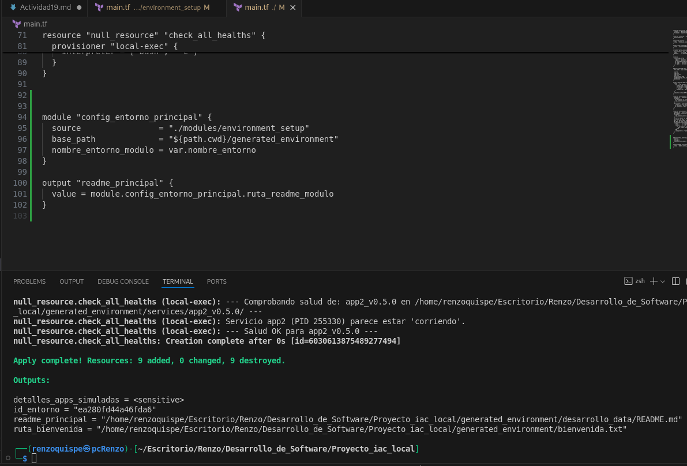
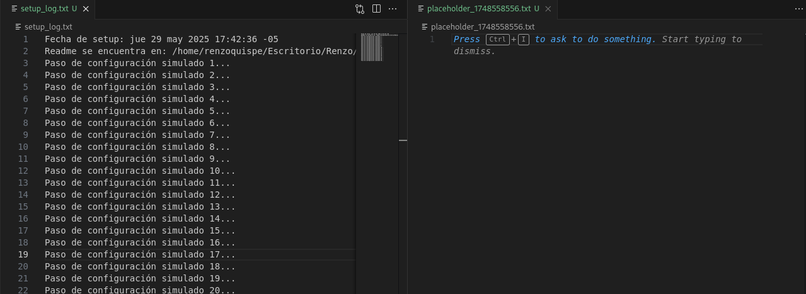
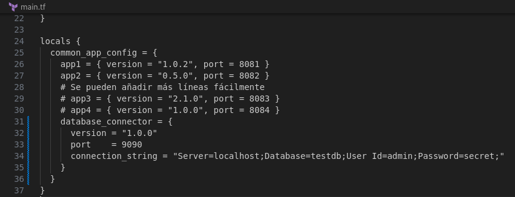
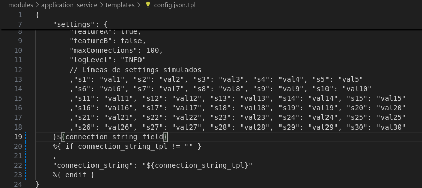
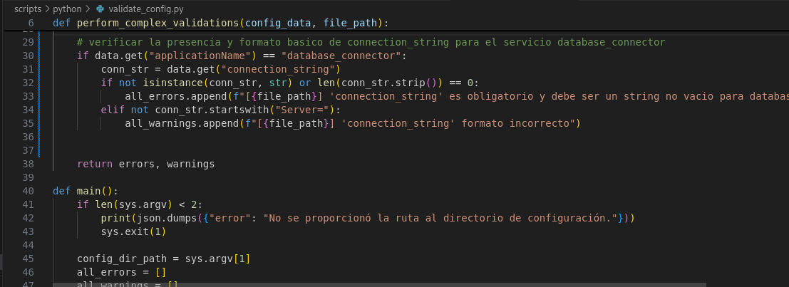
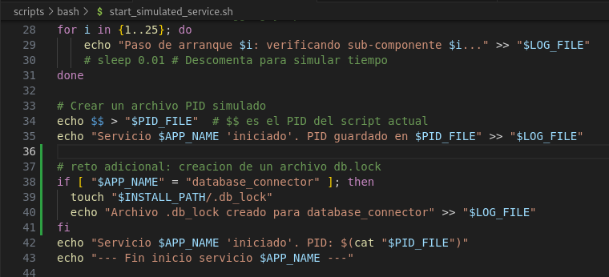
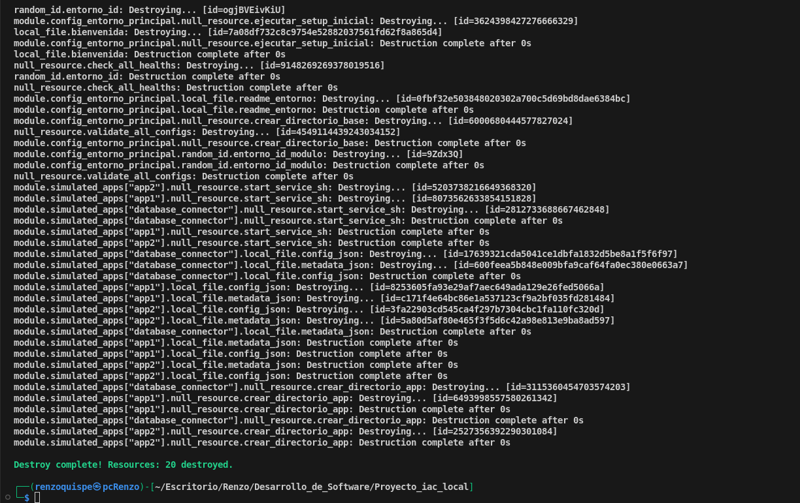
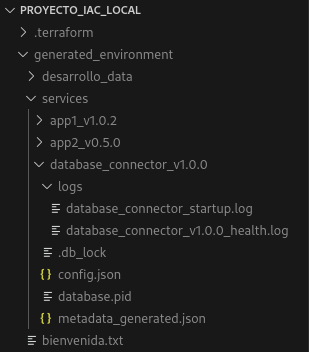

### Actividad 19 : Orquestador local de entornos de desarrollo simulados con Terraform

Demostraremos los conceptos y principios fundamentales de IaC utilizando Terraform para gestionar un entorno de desarrollo simulado completamente
local. Aprenderemos a definir, aprovisionar y modificar "infraestructura" (archivos, directorios, scripts de configuración)  de forma reproducible y automatizada.

#### **Prerrequisitos:**

 - Terraform instalado localmente.
 - Python 3 instalado localmente.
 - Conocimientos básicos de la línea de comandos (Bash).
 - Un editor de texto o IDE.


#### Estructura del proyecto (Archivos y directorios)

Puedes revisar las instrucciones adicionales y el código completo y sus modificaciones dependiendo de tu sistema operativo en [proyecto inicial de IaC](https://github.com/kapumota/DS/tree/main/2025-1/Proyecto_iac_local).

```
proyecto_iac_local/
├── main.tf                     # Configuración principal de Terraform
├── variables.tf                # Variables de entrada
├── outputs.tf                  # Salidas del proyecto
├── versions.tf                 # Versiones de Terraform y providers (local, random)
├── terraform.tfvars.example    # Ejemplo de archivo de variables
│
├── modules/
│   ├── application_service/    # Módulo para simular un "servicio"
│   │   ├── main.tf
│   │   ├── variables.tf
│   │   ├── outputs.tf
│   │   └── templates/
│   │       └── config.json.tpl # Plantilla de configuración del servicio
│   │
│   └── environment_setup/      # Módulo para la configuración base del entorno
│       ├── main.tf
│       ├── variables.tf
│       └── scripts/
│           └── initial_setup.sh # Script de Bash para tareas iniciales
│
├── scripts/                    # Scripts globales
│   ├── python/
│   │   ├── generate_app_metadata.py # Genera metadatos complejos para apps
│   │   ├── validate_config.py       # Valida archivos de configuración generados
│   │   └── report_status.py         # Genera un reporte del "estado" del entorno
│   └── bash/
│       ├── start_simulated_service.sh # Simula el "arranque" de un servicio
│       └── check_simulated_health.sh  # Simula una "comprobación de salud"
│
└── generated_environment/      # Directorio creado por Terraform
    └── (aquí se crearán archivos y directorios)
```


### Actividad detallada por fases y conceptos

**Fase 0: Preparación e introducción**

1.  **¿Qué es infraestructura?**
      * Explica que, en este contexto local, la "infraestructura" serán directorios, archivos de configuración, scripts y la estructura lógica que los conecta.
      * Compara con infraestructura tradicional (servidores físicos, redes) y cloud (VMs, VPCs).
2.  **¿Qué es infraestructura como código (IaC)?**
      * **Configuración manual de infraestructura:**
          * Simula la creación manual de `generated_environment/app1/config.json` y `generated_environment/app1/run.sh`. Discute la propensión a errores, la falta de reproducibilidad y la dificultad para escalar.
      * **Infraestructura como código:**
          * Repasa Terraform como la herramienta que nos permitirá definir esta estructura en archivos de código (`.tf`).
          * Revisa un `main.tf` muy simple que solo cree un directorio. Presenta a tus compañeros un ejemplo.
      * **¿Qué NO es infraestructura como código?**
          * Escribe script que modifican infraestructura existente sin un estado deseado definido.
          * Documenta sobre cómo configurar manualmente (aunque es útil, no es IaC).
          * Modifica manualmente los recursos creados por Terraform después de `apply`.

**Fase 1: Fundamentos de terraform y primer recurso local**

  * **Concepto:** Creación básica de recursos.
  * **Archivos a crear/modificar:**
      * `versions.tf`:
        ```terraform
        terraform {
          required_version = ">= 1.0"
          required_providers {
            local = {
              source  = "hashicorp/local"
              version = "~> 2.5"
            }
            random = {
              source  = "hashicorp/random"
              version = "~> 3.6"
            }
          }
        }
        ```
      * `main.tf`:
        ```terraform
        resource "local_file" "bienvenida" {
          content  = "Bienvenido al proyecto IaC local! Hora: ${timestamp()}"
          filename = "${path.cwd}/generated_environment/bienvenida.txt"
        }

        resource "random_id" "entorno_id" {
          byte_length = 8
        }

        output "id_entorno" {
          value = random_id.entorno_id.hex
        }

        output "ruta_bienvenida" {
          value = local_file.bienvenida.filename
        }
        ```
**Fase 2: Variables, archivos de configuración y scripts Bash**

  * **Conceptos:** Parametrización, ejecución de scripts locales.
  * **Archivos a crear/modificar:**
      * `variables.tf`:
        ```terraform
        variable "nombre_entorno" {
          description = "Nombre base para el entorno generado."
          type        = string
          default     = "desarrollo"
        }

        variable "numero_instancias_app_simulada" {
          description = "Cuántas instancias de la app simulada crear."
          type        = number
          default     = 2
        }

        variable "mensaje_global" {
          description = "Un mensaje para incluir en varios archivos."
          type        = string
          default     = "Configuración gestionada por Terraform."
          sensitive   = true # Para demostrar
        }
        ```
      * `terraform.tfvars.example`:
        ```hcl
        nombre_entorno = "mi_proyecto_local"
        numero_instancias_app_simulada = 3
        // mensaje_global se puede omitir para usar default, o definir aquí.
        ```
      * `modules/environment_setup/main.tf`:
        ```terraform
        variable "base_path" {
          description = "Ruta base para el entorno."
          type        = string
        }

        variable "nombre_entorno_modulo" {
          description = "Nombre del entorno para este módulo."
          type        = string
        }

        resource "null_resource" "crear_directorio_base" {
          # Usar provisioner para crear el directorio si no existe
          # Esto asegura que el directorio existe antes de que otros recursos intenten usarlo
          provisioner "local-exec" {
            command = "mkdir -p ${var.base_path}/${var.nombre_entorno_modulo}_data"
          }
          # Añadir un trigger para que se ejecute si cambia el nombre del entorno
          triggers = {
            dir_name = "${var.base_path}/${var.nombre_entorno_modulo}_data"
          }
        }

        resource "local_file" "readme_entorno" {
          content  = "Este es el entorno ${var.nombre_entorno_modulo}. ID: ${random_id.entorno_id_modulo.hex}"
          filename = "${var.base_path}/${var.nombre_entorno_modulo}_data/README.md"
          depends_on = [null_resource.crear_directorio_base]
        }

        resource "random_id" "entorno_id_modulo" {
          byte_length = 4
        }

        resource "null_resource" "ejecutar_setup_inicial" {
          depends_on = [local_file.readme_entorno]
          triggers = {
            readme_md5 = local_file.readme_entorno.content_md5 # Se re-ejecuta si el README cambia
          }
          provisioner "local-exec" {
            command     = "bash ${path.module}/scripts/initial_setup.sh '${var.nombre_entorno_modulo}' '${local_file.readme_entorno.filename}'"
            interpreter = ["bash", "-c"]
            working_dir = "${var.base_path}/${var.nombre_entorno_modulo}_data" # Ejecutar script desde aquí
          }
        }

        output "ruta_readme_modulo" {
          value = local_file.readme_entorno.filename
        }
        ```
      * `modules/environment_setup/variables.tf`: (declarar `base_path`, `nombre_entorno_modulo`)
      * `modules/environment_setup/scripts/initial_setup.sh`:
        ```bash
        #!/bin/bash
        # Script: initial_setup.sh
        ENV_NAME=$1
        README_PATH=$2
        echo "Ejecutando setup inicial para el entorno: $ENV_NAME"
        echo "Fecha de setup: $(date)" > setup_log.txt
        echo "Readme se encuentra en: $README_PATH" >> setup_log.txt
        echo "Creando archivo de placeholder..."
        touch placeholder_$(date +%s).txt
        echo "Setup inicial completado."
        # Simular más líneas de código
        for i in {1..20}; do
            echo "Paso de configuración simulado $i..." >> setup_log.txt
            # sleep 0.01 # Descomenta para simular trabajo
        done
        ```
      * Modificar `main.tf` (raíz) para usar el módulo `environment_setup`:
        ```terraform
        module "config_entorno_principal" {
          source                = "./modules/environment_setup"
          base_path             = "${path.cwd}/generated_environment"
          nombre_entorno_modulo = var.nombre_entorno
        }

        output "readme_principal" {
          value = module.config_entorno_principal.ruta_readme_modulo
        }
        ```
        
        - main.tf(raiz) modificado
        
        - archivos generados
        

**Fase 3: Módulos, plantillas y scripts Python**

  * **Conceptos:** Modularización, generación dinámica de archivos, integración con Python.
  * **Archivos a crear/modificar:**
      * `modules/application_service/main.tf`:
        ```terraform
        variable "app_name" { type = string }
        variable "app_version" { type = string }
        variable "app_port" { type = number }
        variable "base_install_path" { type = string }
        variable "global_message_from_root" { type = string }
        variable "python_exe" { type = string } # Ruta al ejecutable de Python

        locals {
          install_path = "${var.base_install_path}/${var.app_name}_v${var.app_version}"
        }

        resource "null_resource" "crear_directorio_app" {
          provisioner "local-exec" {
            command = "mkdir -p ${local.install_path}/logs"
          }
          triggers = {
            dir_path = local.install_path
          }
        }

        data "template_file" "app_config" {
          template = file("${path.module}/templates/config.json.tpl")
          vars = {
            app_name_tpl    = var.app_name
            app_version_tpl = var.app_version
            port_tpl        = var.app_port
            deployed_at_tpl = timestamp()
            message_tpl     = var.global_message_from_root
          }
        }

        resource "local_file" "config_json" {
          content         = data.template_file.app_config.rendered
          filename        = "${local.install_path}/config.json"
          depends_on      = [null_resource.crear_directorio_app]
        }

        # Uso de Python para generar metadatos más complejos
        data "external" "app_metadata_py" {
          program = [var.python_exe, "${path.root}/scripts/python/generate_app_metadata.py"]
          query = {
            app_name    = var.app_name
            version     = var.app_version
            input_data  = "datos_adicionales_para_python"
            # Más de 20 líneas de query simuladas
            q1 = "v1", q2 = "v2", q3 = "v3", q4 = "v4", q5 = "v5"
            q6 = "v6", q7 = "v7", q8 = "v8", q9 = "v9", q10 = "v10"
            q11 = "v11", q12 = "v12", q13 = "v13", q14 = "v14", q15 = "v15"
            q16 = "v16", q17 = "v17", q18 = "v18", q19 = "v19", q20 = "v20"
          }
        }

        resource "local_file" "metadata_json" {
          content         = data.external.app_metadata_py.result.metadata_json_string
          filename        = "${local.install_path}/metadata_generated.json"
          depends_on      = [null_resource.crear_directorio_app]
        }

        # Simular "arranque" de servicio
        resource "null_resource" "start_service_sh" {
          depends_on = [local_file.config_json, local_file.metadata_json]
          triggers = {
            config_md5 = local_file.config_json.content_md5
            metadata_md5 = local_file.metadata_json.content_md5
          }
          provisioner "local-exec" {
            command = "bash ${path.root}/scripts/bash/start_simulated_service.sh '${var.app_name}' '${local.install_path}' '${local_file.config_json.filename}'"
          }
        }

        output "service_config_path" {
          value = local_file.config_json.filename
        }
        output "service_install_path" {
          value = local.install_path
        }
        output "service_metadata_content" {
          value = jsondecode(data.external.app_metadata_py.result.metadata_json_string)
        }
        ```
      * `modules/application_service/variables.tf`: (declarar `app_name`, `app_version`, etc.)
      * `modules/application_service/templates/config.json.tpl`:
        ```json
        {
            "applicationName": "${app_name_tpl}",
            "version": "${app_version_tpl}",
            "listenPort": ${port_tpl},
            "deploymentTime": "${deployed_at_tpl}",
            "notes": "Este es un archivo de configuración autogenerado. ${message_tpl}",
            "settings": {
                "featureA": true,
                "featureB": false,
                "maxConnections": 100,
                "logLevel": "INFO"
                // Líneas de settings simulados
                ,"s1": "val1", "s2": "val2", "s3": "val3", "s4": "val4", "s5": "val5"
                ,"s6": "val6", "s7": "val7", "s8": "val8", "s9": "val9", "s10": "val10"
                ,"s11": "val11", "s12": "val12", "s13": "val13", "s14": "val14", "s15": "val15"
                ,"s16": "val16", "s17": "val17", "s18": "val18", "s19": "val19", "s20": "val20"
                ,"s21": "val21", "s22": "val22", "s23": "val23", "s24": "val24", "s25": "val25"
                ,"s26": "val26", "s27": "val27", "s28": "val28", "s29": "val29", "s30": "val30"
            }
        }
        ```
      * `scripts/python/generate_app_metadata.py`:
        ```python
        import json
        import sys
        import datetime
        import uuid

        # Función para simular lógica compleja
        def complex_logic_simulation(app_name, version):
            # Simular múltiples operaciones y generación de datos
            data_points = []
            for i in range(15): # Generar 15 líneas de "lógica"
                data_points.append(f"Simulated data point {i} for {app_name} v{version} - {uuid.uuid4()}")

            dependencies = {} # Simular 10 líneas de dependencias
            for i in range(10):
                dependencies[f"dep_{i}"] = f"version_{i}.{i+1}"

            computed_values = {} # Simular 10 líneas de valores computados
            for i in range(10):
                computed_values[f"val_{i}"] = i * 100 / (i + 0.5)

            return {
                "generated_data_points": data_points,
                "simulated_dependencies": dependencies,
                "calculated_metrics": computed_values,
                "generation_details": [f"Detail line {j}" for j in range(15)] # 15 líneas más
            }

        def main():
            if len(sys.argv) > 1 and sys.argv[1] == "--test-lines": # Para contar líneas fácilmente
                print(f"Lineas de código Python (incluyendo comentarios y espacios).")
                # Simulación de más líneas para conteo
                for i in range(60): # 60 print statements
                    print(f"Línea de prueba {i}")
                return

            input_str = sys.stdin.read()
            input_json = json.loads(input_str)

            app_name = input_json.get("app_name", "unknown_app")
            app_version = input_json.get("version", "0.0.0")
            # input_data = input_json.get("input_data", "") # Usar si es necesario

            # Lógica de generación de metadatos
            metadata = {
                "appName": app_name,
                "appVersion": app_version,
                "generationTimestamp": datetime.datetime.utcnow().isoformat(),
                "generator": "Python IaC Script",
                "uniqueId": str(uuid.uuid4()),
                "parametersReceived": input_json,
                "simulatedComplexity": complex_logic_simulation(app_name, app_version),
                "additional_info": [f"Info line {k}" for k in range(10)], 
                "status_flags": {f"flag_{l}": (l % 2 == 0) for l in range(10)} 
            }
            # Simulación de más lógica de negocio (30 líneas)
            metadata["processing_log"] = []
            for i in range(30):
                metadata["processing_log"].append(f"Log entry {i}: Processed item {uuid.uuid4()}")

            # El script DEBE imprimir un JSON válido a stdout para 'data "external"'
            print(json.dumps({"metadata_json_string": json.dumps(metadata, indent=2)}))

        if __name__ == "__main__":
            main()
        ```
      * `scripts/bash/start_simulated_service.sh` :
        ```bash
        #!/bin/bash
        APP_NAME=$1
        INSTALL_PATH=$2
        CONFIG_FILE=$3

        echo "--- Iniciando servicio simulado: $APP_NAME ---"
        echo "Ruta de instalación: $INSTALL_PATH"
        echo "Archivo de configuración: $CONFIG_FILE"

        if [ ! -f "$CONFIG_FILE" ]; then
          echo "ERROR: Archivo de configuración no encontrado: $CONFIG_FILE"
          exit 1
        fi

        PID_FILE="$INSTALL_PATH/${APP_NAME}.pid"
        LOG_FILE="$INSTALL_PATH/logs/${APP_NAME}_startup.log"

        echo "Simulando inicio de $APP_NAME a las $(date)" >> "$LOG_FILE"
        # Simular más líneas de logging y operaciones
        for i in {1..25}; do
            echo "Paso de arranque $i: verificando sub-componente $i..." >> "$LOG_FILE"
            # sleep 0.01 # Descomentar para simular tiempo
        done

        # Crear un archivo PID simulado
        echo $$ > "$PID_FILE" # $$ es el PID del script actual
        echo "Servicio $APP_NAME 'iniciado'. PID guardado en $PID_FILE" >> "$LOG_FILE"
        echo "Servicio $APP_NAME 'iniciado'. PID: $(cat $PID_FILE)"
        echo "--- Fin inicio servicio $APP_NAME ---"
        ```
      * `main.tf` (raíz) para instanciar el módulo `application_service` varias veces:
        ```terraform
        variable "python_executable" {
          description = "Ruta al ejecutable de Python (python o python3)."
          type        = string
          default     = "python3" # Ajustar según el sistema
        }

        locals {
          common_app_config = {
            app1 = { version = "1.0.2", port = 8081 }
            app2 = { version = "0.5.0", port = 8082 }
            # Se pueden añadir más lineas de codigo
            # app3 = { version = "2.1.0", port = 8083 }
            # app4 = { version = "1.0.0", port = 8084 }
          }
        }

        module "simulated_apps" {
          for_each = local.common_app_config

          source                = "./modules/application_service"
          app_name              = each.key
          app_version           = each.value.version
          app_port              = each.value.port
          base_install_path     = "${path.cwd}/generated_environment/services"
          global_message_from_root = var.mensaje_global # Pasar la variable sensible
          python_exe            = var.python_executable
        }

        output "detalles_apps_simuladas" {
          value = {
            for k, app_instance in module.simulated_apps : k => {
              config_path   = app_instance.service_config_path
              install_path  = app_instance.service_install_path
              # metadata    = app_instance.service_metadata_content # Puede ser muy verboso
              metadata_id = app_instance.service_metadata_content.uniqueId
            }
          }
          sensitive = true # Porque contiene mensaje_global (indirectamente)
        }
        ```

**Fase 4: Validación y reportes (Python y Bash)**

  * **Conceptos:** Scripts para verificar el estado, gestión del cambio (implícita).
  * **Archivos a crear/modificar:**
      * `scripts/python/validate_config.py`:
        ```python
        import json
        import sys
        import os

        # Función para simular validaciones complejas
        def perform_complex_validations(config_data, file_path):
            errors = []
            warnings = []
            # Simular 20 líneas de validaciones
            if not isinstance(config_data.get("applicationName"), str):
                errors.append(f"[{file_path}] 'applicationName' debe ser un string.")
            if not isinstance(config_data.get("listenPort"), int):
                errors.append(f"[{file_path}] 'listenPort' debe ser un entero.")
            elif not (1024 < config_data.get("listenPort", 0) < 65535):
                warnings.append(f"[{file_path}] 'listenPort' {config_data.get('listenPort')} está fuera del rango común.")

            # Más validaciones simuladas 
            for i in range(10):
                if f"setting_{i}" not in config_data.get("settings", {}):
                     warnings.append(f"[{file_path}] Falta 'settings.setting_{i}'.")
            if len(config_data.get("notes", "")) < 10:
                warnings.append(f"[{file_path}] 'notes' es muy corto.")

            # Simulación de 15 chequeos adicionales
            for i in range(15):
                if config_data.get("settings",{}).get(f"s{i+1}") == None:
                     errors.append(f"[{file_path}] Falta el setting s{i+1}")

            return errors, warnings

        def main():
            if len(sys.argv) < 2:
                print(json.dumps({"error": "No se proporcionó la ruta al directorio de configuración."}))
                sys.exit(1)

            config_dir_path = sys.argv[1]
            all_errors = []
            all_warnings = []
            files_processed = 0

            # Simulación de lógica de recorrido y validación
            for root, _, files in os.walk(config_dir_path):
                for file in files:
                    if file == "config.json": # Solo valida los config.json
                        file_path = os.path.join(root, file)
                        try:
                            with open(file_path, 'r') as f:
                                data = json.load(f)
                            errors, warnings = perform_complex_validations(data, file_path)
                            all_errors.extend(errors)
                            all_warnings.extend(warnings)
                            files_processed += 1
                        except json.JSONDecodeError:
                            all_errors.append(f"[{file_path}] Error al decodificar JSON.")
                        except Exception as e:
                            all_errors.append(f"[{file_path}] Error inesperado: {str(e)}")

            # Simulación de más líneas de código de reporte
            report_summary = [f"Archivo de resumen de validación generado el {datetime.datetime.now()}"]
            for i in range(19):
                report_summary.append(f"Línea de sumario {i}")


            print(json.dumps({
                "validation_summary": f"Validados {files_processed} archivos de configuración.",
                "errors_found": all_errors,
                "warnings_found": all_warnings,
                "detailed_report_lines": report_summary # Más líneas
            }))

        if __name__ == "__main__":
            # Añadir import datetime si no está
            import datetime
            main()
        ```
      * `scripts/bash/check_simulated_health.sh`:
        ```bash
        #!/bin/bash
        SERVICE_PATH=$1
        SERVICE_NAME=$(basename "$SERVICE_PATH") # Asumir que el último componente es el nombre

        echo "--- Comprobando salud de: $SERVICE_NAME en $SERVICE_PATH ---"
        LOG_FILE="$SERVICE_PATH/logs/${SERVICE_NAME}_health.log"
        PID_FILE="$SERVICE_PATH/${SERVICE_NAME}.pid" # Nombre del servicio sin _vX.Y.Z

        # Intentar extraer nombre base del servicio (app1 de app1_v1.0.2)
        BASE_SERVICE_NAME=$(echo "$SERVICE_NAME" | cut -d'_' -f1)
        PID_FILE_ACTUAL="$SERVICE_PATH/${BASE_SERVICE_NAME}.pid"


        echo "Comprobación iniciada a $(date)" > "$LOG_FILE"
        # Simular más líneas de operaciones y logging
        for i in {1..20}; do
            echo "Paso de comprobación $i: verificando recurso $i..." >> "$LOG_FILE"
        done

        if [ -f "$PID_FILE_ACTUAL" ]; then
            PID=$(cat "$PID_FILE_ACTUAL")
            # En un sistema real, verificaríamos si el proceso con ese PID existe.
            # Aquí simulamos que está "corriendo" si el PID file existe.
            echo "Servicio $BASE_SERVICE_NAME (PID $PID) parece estar 'corriendo'." | tee -a "$LOG_FILE"
            echo "HEALTH_STATUS: OK" >> "$LOG_FILE"
            echo "--- Salud OK para $SERVICE_NAME ---"
            exit 0
        else
            echo "ERROR: Archivo PID $PID_FILE_ACTUAL no encontrado. $BASE_SERVICE_NAME parece no estar 'corriendo'." | tee -a "$LOG_FILE"
            echo "HEALTH_STATUS: FAILED" >> "$LOG_FILE"
            echo "--- Salud FALLIDA para $SERVICE_NAME ---"
            exit 1
        fi
        ```
      * Añadir a `main.tf` (raíz) `null_resource`s para ejecutar estos scripts:
        ```terraform
        resource "null_resource" "validate_all_configs" {
          depends_on = [module.simulated_apps] # Asegura que las apps se creen primero
          triggers = {
            # Re-validar si cualquier output de las apps cambia (muy general, pero para el ejemplo)
            app_outputs_json = jsonencode(module.simulated_apps)
          }
          provisioner "local-exec" {
            command = "${var.python_executable} ${path.cwd}/scripts/python/validate_config.py ${path.cwd}/generated_environment/services"
            # Opcional: ¿qué hacer si falla?
            # on_failure = fail # o continue
          }
        }

        resource "null_resource" "check_all_healths" {
          depends_on = [null_resource.validate_all_configs] # Después de validar
          # Triggers similares o basados en los PIDs si los expusiéramos como output
          triggers = {
            app_outputs_json = jsonencode(module.simulated_apps)
          }
          # Usar un bucle for para llamar al script de health check para cada servicio
          # Esto es un poco más avanzado con provisioners, una forma simple es invocar un script que lo haga internamente
          # O, si quisiéramos hacerlo directamente con N llamadas:
          # (Esto es solo ilustrativo, un script que itere sería mejor para muchos servicios)
          provisioner "local-exec" {
            when    = create # o always si se quiere
            command = <<EOT
              for service_dir in $(ls -d ${path.cwd}/generated_environment/services/*/); do
                bash ${path.cwd}/scripts/bash/check_simulated_health.sh "$service_dir"
              done
            EOT
            interpreter = ["bash", "-c"]
          }
        }
        ```
        - "terraform apply" tras crear y/o modificar
        


#### Ejercicios

1.  **Ejercicio de evolvabilidad y resolución de problemas:**

      * **Tarea:** Añade un nuevo "servicio" llamado `database_connector` al `local.common_app_config` en `main.tf`. Este servicio requiere un parámetro adicional en su configuración JSON llamado `connection_string`.
      * **Pasos:**
        1.  Modifica `main.tf` para incluir `database_connector`.
          
        2.  Modifica el módulo `application_service`:
              * Añade una nueva variable `connection_string_tpl` (opcional, por defecto un string vacío).
              
              * Actualiza `config.json.tpl` para incluir este nuevo campo.
              * Haz que el `connection_string` solo se incluya si la variable no está vacía (usar condicionales en la plantilla o en `locals` del módulo).
              
        3.  Actualiza el script `validate_config.py` para que verifique la presencia y formato básico de `connection_string` SOLO para el servicio `database_connector`.
        
      * **Reto adicional:** Haz que el `start_simulated_service.sh` cree un archivo `.db_lock` si el servicio es `database_connector`.
      
      - terraform apply
      
      - archivos creados
      

2.  **Ejercicio de refactorización y principios:**

      * **Tarea:** Actualmente, el `generate_app_metadata.py` se llama para cada servicio. Imagina que parte de los metadatos es común a *todos* los servicios en un "despliegue" (ej. un `deployment_id` global).
      * **Pasos:**
        1.  Crea un nuevo script Python, `generate_global_metadata.py`, que genere este `deployment_id` (puede ser un `random_uuid`).
        2.  En el `main.tf` raíz, usa `data "external"` para llamar a este nuevo script UNA SOLA VEZ.
        3.  Pasa el `deployment_id` resultante como una variable de entrada al módulo `application_service`.
        4.  Modifica `generate_app_metadata.py` y/o `config.json.tpl` dentro del módulo `application_service` para que incorpore este `deployment_id` global.
      * **Discusión:** ¿Cómo mejora esto la composabilidad y reduce la redundancia? ¿Cómo afecta la idempotencia?

3.  **Ejercicio de idempotencia y scripts externos:**

      * **Tarea:** El script `initial_setup.sh` crea `placeholder_$(date +%s).txt`, lo que significa que cada vez que se ejecuta (si los `triggers` lo permiten), crea un nuevo archivo.
      * **Pasos:**
        1.  Modifica `initial_setup.sh` para que sea más idempotente: antes de crear `placeholder_...txt`, debe verificar si ya existe un archivo `placeholder_control.txt`. Si no existe, lo crea y también crea el `placeholder_...txt`. Si `placeholder_control.txt` ya existe, no hace nada más.
        2.  Ajusta los `triggers` del `null_resource "ejecutar_setup_inicial"` en el módulo `environment_setup` para que el script se ejecute de forma más predecible (quizás solo si una variable específica cambia).
      * **Reto adicional:** Implementa un "contador de ejecución" en un archivo dentro de `generated_environment`, que el script `initial_setup.sh` incremente solo si realmente realiza una acción.

4.  **Ejercicio de seguridad simulada y validación:**

      * **Tarea:** El `mensaje_global` se marca como `sensitive` en `variables.tf`. Sin embargo, se escribe directamente en `config.json`.
      * **Pasos:**
        1.  Modifica el script `validate_config.py` para que busque explícitamente el contenido de `mensaje_global` (que el estudiante tendrá que "conocer" o pasar como argumento al script de validación) dentro de los archivos `config.json`. Si lo encuentra, debe marcarlo como un "hallazgo de seguridad crítico".
        2.  Discute cómo Terraform maneja los valores `sensitive` y cómo esto se puede perder si no se tiene cuidado al pasarlos a scripts o plantillas.
        3.  (Opcional) Modifica la plantilla `config.json.tpl` para ofuscar o no incluir directamente el `mensaje_global` si es demasiado sensible, tal vez solo una referencia.

#### Presentación

Presenta la actividad completa en tu repositorio indicando los cambios realizados por los ejercicios a partir del código entregado.